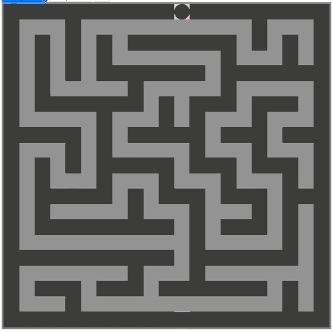

A Maze Exercise
=================

This little project was born out of personal interest and by investigating into "Software Developer Interview Questions":
Generating and solving (finding a way through) a Maze are two common programmer's problems, where many simple and
complex algorithms and solving strategies exist.

Overview
---------

The project is a small HTML/Javascript application which:

* provides a Maze class that is able to generate a (random) Maze
  and which provides functionalities for a potential Solving algorithm to
  "walk" through the Maze

* provides a Reference Implementation for a Maze Solver, which takes
  the Maze and finds a way through it, both in a synchronous
  and asynchronous way

* provides an "Exercise" skeleton, which can be taken as an interview
  problem: A Maze Solver should be implemented by the Interviewee
  that acts similar to the Reference Implementation

The Reference Implementation of the Maze Solver is a simple recursive algorithm, finding A way out, not the shortest.
It also returns a "Direction" array with the solution.


A glimpse on the working algorithm
-----------------------------------



Usage
------

### install necessary build tools and libraries

```
git clone https://github.com/bylexus/maze-exercise.git
cd maze-exercise
npm install
```

### Maze class (maze.js)

#### Example

```javascript
// Initialization: container, width, height:
var maze = new Maze(document.getElementById('mazeContainer'),20,20);

console.log('Move down, if possible!',maze.move('down')); // true when the move could be done

console.log('What lies left from me?',maze.explore('left')); // 0 = wall, 1 = passage, 2 = start, 3 = exit, 9 = passage, already visited

console.log('did I reach the exit?',maze.isExit()); // true when player stands on exit right now

```

### MazeSolver reference implementation (maze_solver.js)

The Reference Implementation uses a simple recursive strategy to find the exit: At each intersection,
try the left, front, right, down direction recursively. If the recursive call returns false, step back
and try the next direction, until the exit is found or until no further directions are available.

The reference implementation also comes with an asynchronous implementation, which updates the UI on each
step (`findExitAsync()`). This allows to watch the algorithm while it is working.


Build
------

```
cd maze-exercise
npm install
grunt
```

This builds 2 versions:

* `build/*`: The running reference implementation (start `build/index.html`)
* `exercise/*`: The Exercise version: As an exercise, code the Maze Solving algorithm in `exercise/maze_solver_exercise.js`.

References
-------------

Maze Generating algorithm (amaze.js) inspired by Henry Kroll III, https://thenerdshow.com/amaze.html


Future ideas
------------

* Implement different Maze generating algorithms
* Implement different Maze solving algorithms

(c) 2015 Alexander Schenkel, alex@alexi.ch
